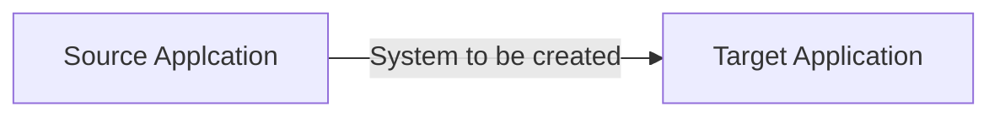
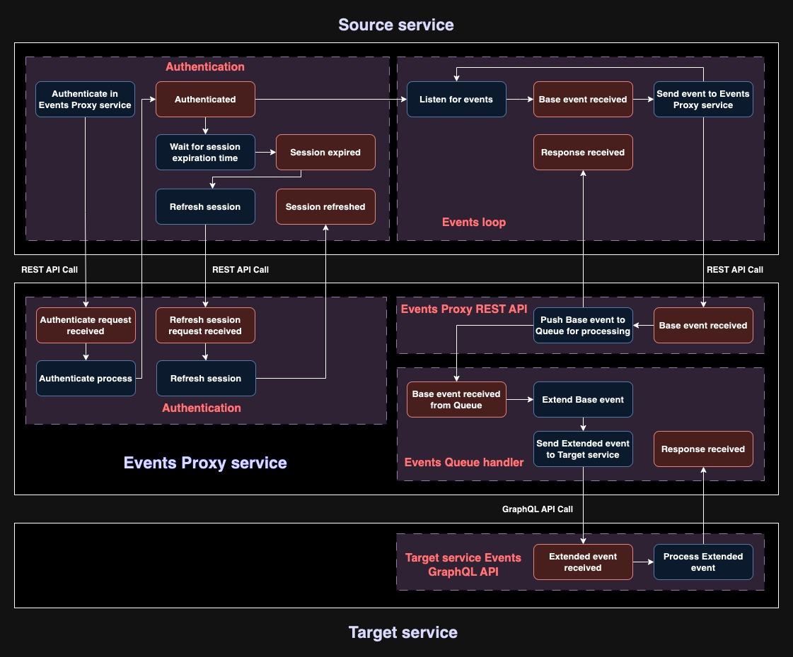
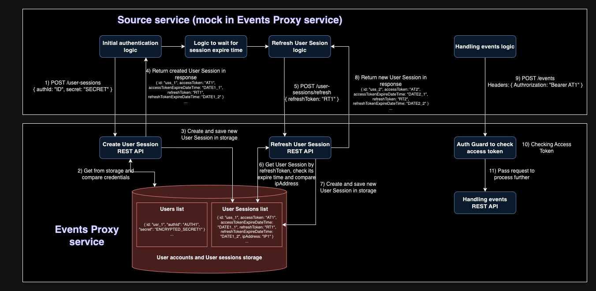
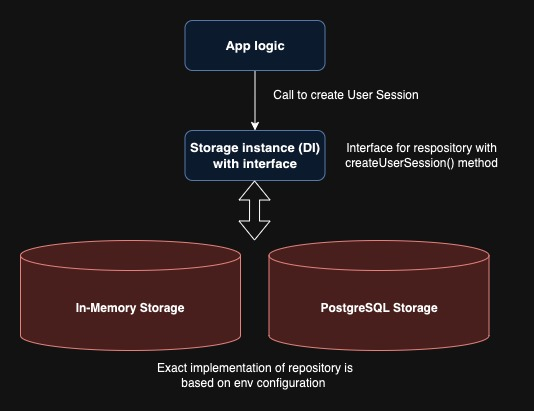
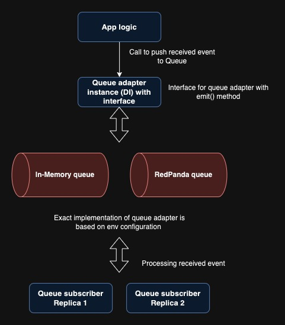

# Events Proxy Service

> Events Proxy to connect Source and Target applications.

    

- [Requirements](#requirements)
- [Run project](#run-project)
- [Deployment](#deployment)
- [High-level arhitecture](#high-level-arhitecture)
  - [Source service authentication logic](#1-source-service-authentication-logic)
  - [Events Proxy Service Authentication Module](#2-events-proxy-service-authentication-module)
  - [Events loop](#3-events-loop)
  - [Events Proxy REST API](#4-events-proxy-rest-api)
  - [Events Queue handler](#5-events-queue-handler)
  - [Target service Events GraphQL API](#6-target-service-events-graphql-api)
- [Technologies](#technologies)
- [Low-level arhitecture and Considerations](#low-level-architecture-and-considerations)
  - [Security](#1-security)
  - [Storage](#2-storage)
  - [Queue and Scalability](#3-queue-and-scalability)
  - [Rate-limiter and Retry logic](#4-rate-limiter-and-retry-logic)
- [Environment variables](#environment-variables)
- [Future improvements](#future-improvements)

## Requirements

Need to connect two applications. Let's call them `source` and `target` application.

- Source application wants to call our API every time an event occurs

  - event structure `{ id: '<randomId>', name: 'test event', body: 'test body', timestamp: '<currentTimestamp>' }`
  - source application sends each event only once and requires 2xx response in 500ms. If source application will not receive 2xx response within 500ms then considers that this event delivery has failed and is not resending it again
  - please mock the API calls from the source application

- Target application needs to receive all the events
  - target application is a GraphQL API - please mock API calls to the target application
  - event structure needs to be enhanced by adding `{ brand: 'testBrand' }` as the target application requires it. Mind that this information is not flowing from the source application
  - the target application is rate-limited. In most cases, events from source application are flowing more frequently than the target application is able to consume them. Please make sure the designed solution will take that into consideration

The goal is to create a `system`, to connect above. As shown in the below graph

### Considerations

- System needs to be working in the cloud
- Deployment must be through CI/CD pipeline
- System needs to be secure (authentication)
- System needs to be highly available
- We need to have full visibility on events flowing between `source` and `target` systems
- We need to be able to trace the flow of every single event
- Everything must be covered with tests
- Everything needs to be properly documented, with HLD and LLD included
- System needs to be easy to maintain and support
- All errors/issues need to be visible and handled properly
- We want to see the source code and the working application
- We want to see not only the solution but also how you think and your working process, so please keep all your commits accessible, don't squash them, and use proper naming standards for them

### Required Technology

- Use Node (TypeScript) or GO as a programming language
- Use Terraform to provision the infrastructure
- Use AWS or GCP

## Run project

#### Local setup

1. Clone this repository: `git clone https://github.com/edolgov92/ch-test.git`
2. Install dependencies: `npm i`
3. Create `.env` file in root folder based on `.env.example` (it is possible just to copy file content without modifications)
4. Run project: `npm start`

By default, it will run with In-Memory message broker and storage.

#### Run tests

After setting up project locally, it is possible to run bot unit and e2e tests using command `npm run test`, and separatelly using commands `npm run test:unit` and `npm run test:e2e`;

## Deployment

The deployment scripts utilize Terraform to provision the service within an AWS EKS Cluster.

#### Prerequisites

For a step-by-step guide to the prerequisites, refer to the article [Provision an EKS cluster (AWS)](https://developer.hashicorp.com/terraform/tutorials/aws/eks). A quick list of requirements includes:

- Terraform v1.3+ installed locally.
- a Terraform Cloud account and organization.
- Terraform Cloud locally authenticated.
- a Terraform Cloud variable set configured with your AWS credentials.
- an AWS account
- the AWS CLI v2.7.0/v1.24.0 or newer, installed and configured
- AWS IAM Authenticator
- kubectl v1.24.0 or newer

See the article for detailed information on each requirement.

#### 1. Creating AWS EKS Cluster

Go to /deployment/create-eks-cluster folder. Then review input variables in `variables.tf`:

- AWS_REGION - AWS region where you plan to create resources, default is "us-east-2"

After that run commands:

`terraform init` \
`terraform apply`

If you want to provide your own values for input variables (in this or next steps), it can be done this way:

`terraform apply -var="AWS_REGION=us-east-1"`

In output you should get `EKS_CLUSTER_NAME`, remember it.

**Note:** review all changes to be made before confirming deployent.

#### 2. Creating AWS ECR

Go to /deployment/create-ecr folder. Then review input variables in `variables.tf`:

- AWS_REGION - AWS region where you plan to create resources, default is "us-east-2"

After that run commands:

`terraform init` \
`terraform apply`

#### 3, Creating AWS RDS Postgres Database

Go to /deployment/create-rds folder. Then review input variables in `variables.tf`:

- AWS_REGION - AWS region where you plan to create resources, default is "us-east-2"
- DB_PASSWORD - RDS Database root `postgres` user password
- IP_ADDRESS - your IP address to be able to connect to created DB
- EKS_CLUSTER_NAME - EKS Cluster name, it is provided in output after creating EKS Cluster in first step.

After that run commands:

`terraform init` \
`terraform apply`

#### 4. CI/CD Configuration

Check prepared pipeline script: `.github/workflows/main.yml`. To let it work you need to set GitHub Secrets:

- AWS_ACCESS_KEY_ID - AWS Access key
- AWS_SECRET_ACCESS_KEY - AWS Secret access key
- TF_API_TOKEN - Terraform API Token that can be created in Terraform Cloud

  and GitHub Variables:

- AWS_REGION - AWS region where all resources are created

After that push to branch, specified in this config file will start deployment process in GitHub Actions.

## High-level arhitecture

The objective is to build a robust and scalable system that serves as an intermediary between two applications: the source and the target application. This system will ensure seamless event data flow from the source to the target application, considering various requirements like authentication, rate-limiting, high availability, and traceability.

Below you can see main components of the system and events that happen:

### 1. Source service authentication logic

#### Introduction

Before the Source service can send any events to our Event Proxy service, it needs to pass an authentication process. This section outlines the authentication logic.

#### Authentication Process

The purpose of authentication is to confirm that the requests to the Event Proxy service are coming from a trusted Source service account.

- If the Source service is a standalone backend application, a single account representing the Source service itself would suffice.
- For multi-user Source services, distinct accounts for each user may be necessary.

#### Token-based Authentication

To successfully pass the authentication, the Source service should provide an `authId` and a `secret`. Upon successful verification, the Event Proxy service will issue an `accessToken` and a `refreshToken`.

- `accessToken`: Short-lived and will be used for making subsequent API requests.
- `refreshToken`: Longer-lived and will be used to obtain new access tokens once they expire.

#### Token Lifespan

The Time-To-Live (TTL) of these tokens depends on the Event Proxy service configuration.

#### Token Refresh Mechanism

Once the `accessToken` expires, the Source service should initiate a token refresh by invoking the Refresh Session API. Here, the `refreshToken` can be exchanged for a new set of `accessToken` and `refreshToken`.

### 2. Events Proxy Service Authentication Module

#### Introduction

The Events Proxy service features a robust authentication module implemented as a REST API. This API is designed to authenticate either individual users or the Source service itself, ensuring that all incoming requests are securely verified.

#### Internal Storage and User Session

The authentication module relies on an internal storage system, which holds a list of existing users along with their credentials (`authId` and encrypted `secret`). During the authentication process, these credentials are cross-referenced with the stored data to validate the identity of the requestor.

#### Authentication Workflow

Here's how the authentication mechanism works:

1. Initial Authentication:

   - When a request comes in, the system compares the provided `authId` and `secret` against the stored credentials.
   - If the credentials are valid, a User Session is initiated.

2. Token Issuance:

   - A new `accessToken` and `refreshToken` are generated and sent back to the Source service.
   - Additional information, like the tokens' expiration dates, may also be sent in the response.

3. Token Refresh:
   - If the Source service already holds an active User Session but needs to refresh the `accessToken` (it's going to expire), it can do so by sending the `refreshToken` via the REST API.
4. Token Validation and Renewal:
   - The system will then validate that the `refreshToken` exists in storage and has not expired.
   - Upon successful validation, new `accessToken` and `refreshToken` are generated and sent back to the Source service. In case `refreshToken` is expired, Source service needs to pass Authentication process again with providing credentials.

By employing this multi-layered approach, the Authentication Module ensures high level of security while providing a smooth user experience.

### 3. Events loop

#### Overview

Once the Source service successfully completes the authentication process, it shifts into a mode where it listens for system events in real-time. For testing and demonstration purposes, this logic is currently mocked. In this mock setup, the Source service itself generates events.

#### Mocked Components

At this stage, all components related to the Source service are also mocked on the Events Proxy side. This approach is primarily for testing and should be replaced with actual components in the production environment.

#### Event Reception and Transmission

Upon receiving or generating an event, the Source service immediately forwards it to the Events Proxy service for processing. This transmission occurs over a REST API, and each request is accompanied by an `accessToken` for authorization purposes.

#### Authorization Workflow

The inclusion of the `accessToken` serves to validate that the Source service has the necessary permissions to send events for further processing by the Events Proxy service. The Events Proxy service verifies the token's validity and proceeds with the event handling if the token is authentic.

#### Continuous Event Handling

This mechanism for capturing and forwarding events is designed as an infinite loop. The loop ensures that the Source service is continually listening for new events and transmitting them securely to the Events Proxy service for further action.

### 4. Events Proxy REST API

#### Objective and Design

The Events Proxy service features a streamlined REST API specifically designed to receive base events from the Source service. The primary objective of this API is twofold:

1. To promptly enqueue the received events into the Events Queue for processing.
2. To swiftly return an acknowledgment response to the Source service.

#### Performance Considerations

Due to the performance constraints dictated by the Source service—namely, requiring a 2xx response within 500ms—this API is engineered to be both fast and reliable. It minimizes computational overhead by focusing solely on the critical paths of event reception and queuing.

#### Minimal Logic for Maximum Efficiency

The API intentionally incorporates minimal logic. By doing so, it minimizes latency and maximizes throughput, thereby ensuring that it can handle high-frequency event data with low response times.

By optimizing for speed and reliability, this REST API serves as a highly efficient bridge between the Source service and the Events Proxy service, ensuring seamless and rapid data transmission.

### 5. Events Queue handler

#### Introduction and Role

Once a base event has been successfully enqueued into the Events Queue, the next step is to initiate its processing. The queue serves as a robust and flexible data structure that is intrinsically designed to support future scalability and high-throughput scenarios.

#### Event Enhancement Process

Upon fetching a base event from the Events Queue, the system immediately augments it with an additional `brand` field. This transforms the base event into what we term an "Extended Event."

#### Integration with Target Service

The Extended Event is then transmitted to the Target service via its GraphQL API.

#### Handling Rate Limitations

It's important to note that the Target service is rate-limited. So GraphQL client that is used by Events Proxy service should have built in rate-limiter to prevent any bottlenecks or overloads at the Target service, facilitating smooth data flow across the system.

#### Summary

By using a queue-based architecture for event handling, we ensure a flexible, scalable, and robust system that can adapt to various operational demands and constraints.

### 6. Target service Events GraphQL API

Currently, the GraphQL API for the Target service is not yet implemented. To facilitate testing, we're temporarily mocking these GraphQL requests within the Events Proxy service. This strategy allows us to move forward with development and testing, while planning to integrate the actual API calls as soon as the Target service becomes operational.

## Technologies

The selected stack of Node.js, TypeScript, and Nest.js offers a robust foundation for implementing sophisticated backend systems. Below is an overview of the technologies and libraries utilized in this project, each chosen for their suitability to specific requirements.

#### TypeScript with Prettier

Utilizing TypeScript and formatting the code with Prettier ensures better code readability and maintainability. This approach is fundamental for collaborative development and future scalability.

#### NestJS

Chosen for its rich ecosystem, NestJS provides modular solutions for common backend tasks like configuration management, logging, integration with message brokers and others.

#### Logging

We leverage NestJS's built-in Logger class, which offers scoped logging that is both easy to implement and interpret, thereby simplifying debugging and monitoring.

#### Configuration Management

The `@nestjs/config` package's ConfigService is integrated into our architecture. It provides dependency injection (DI) capabilities, facilitating easy unit testing through mockable configurations.

#### Testing Framework

We employ Jest for both unit and end-to-end testing. Additionally, the `@nestjs/testing` package allows us to mock NestJS modules, while `supertest` aids in simplifying API testing for end-to-end scenarios.

#### Authentication & Authorization

JWT-based authentication and authorization have been implemented as they are widely recognized and reliable. We've utilized packages such as `@nestjs/jwt`, `@nestjs/passport`, and `passport-jwt` to streamline this process.

#### Message Broker

- **Local Development**: An In-Memory message broker suffices, providing speed, ease of setup, and testability.
- **Production**: RedPanda is chosen as simple, powerful, and cost-efficient streaming data platform that scales with predictable latencies and is compatible with Kafka APIs while eliminating Kafka complexity.

#### Data Storage

- **Local Development**: In-Memory storage serves well for user accounts and sessions, requiring no additional setup and aiding rapid testing.
- **Production**: PostgreSQL is used for its suitability to well-structured data. As the system evolves, a transition to MongoDB can be considered for semi-structured data, and Redis could be introduced for caching.

#### GraphQL Client

Package `graphql-request` was used due to its simplicity and lightweight nature, making it an good choice for integrating with the GraphQL API. On the top of client rate-limiting logic was implemented with `limiter` package and retry logic was implemented with `async-retry` package.

This comprehensive technology stack is designed to be robust, yet flexible, catering both to our immediate requirements and future scalability.

## Low-Level Architecture and Considerations

### 1. Security

#### Overview

Security is of paramount importance in our system's architecture, primarily focusing on authentication, authorization, data validation, rate-limiting, and attack prevention.

Authentication process:

Below are the key aspects of our security considerations.

#### JWT Authentication

JSON Web Tokens (JWT) used for both authentication and authorization. The process begins with the Source service sending its `authId` and `secret` to our Events Proxy service. Upon successful validation, the service issues an `accessToken` and a `refreshToken`.

- **Access Token**: Short-lived, this token is used to authorize the Source service to access specific resources.
- **Refresh Token**: Longer-lived, this token is used to acquire a new access token when the latter expires.

#### Session Refresh with IP Binding

Refreshing a session is allowed only through a `refreshToken`. Importantly, the refresh token is bound to the client's IP address. This means that attempting to refresh the session from a different IP address will fail, requiring the client to authenticate again. This measure enhances security by mitigating the risk of token theft.

#### Rate-Limiting

To protect against brute-force and DDoS attacks, a rate-limiter is integrated into the Events Proxy service. This ensures that the system remains responsive and stable by limiting the number of API calls a client can make within a specified time frame.

#### Data Validation and Transformation

- **Class-Validator**: Used `class-validator` to perform runtime validation on incoming data against predefined rules. This ensures that only valid data is processed further.
- **Class-Transformer**: With `class-transformer`, system automatically filter out any extraneous fields not present in initial model, thereby sanitizing the data payload.

#### Using Helmet

Using of `helmet` package helps to secure our Express.js application, which is the foundation of our NestJS app. It helps protect the system against several types of web vulnerabilities by setting various HTTP headers.

### 2. Storage

#### Overview

Our application is designed with storage flexibility in mind, allowing for easy switching between different storage implementations. This ensures that the system can adapt to varying requirements and constraints without significant code changes.

#### Configurable via Environment Variables

The type of storage to be used can be simply specified through environment variables in the application's configuration. This enables quick transitions between different storage solutions without altering the application logic.

#### In-Memory Storage

For local development and testing purposes, an In-Memory storage option is available. This is particularly useful for rapid prototyping and testing scenarios where persistence is not a primary concern. It offers the benefit of speed and reduced setup complexity.

#### PostgreSQL Storage

For production environments, a PostgreSQL storage is in place, which is more suited for scenarios that require data persistence, ACID compliance, and robust querying capabilities.

### 3. Queue and Scalability

#### Overview

The architecture is designed to be agnostic to the specific Message Broker implementation used, thereby ensuring that the application remains scalable and adaptable to different environments and requirements.

#### Configurability Through Environment Variables

Much like our storage solution, the choice of Message Broker can be configured using environment variables. This means you can effortlessly switch between different queueing solutions without having to re-engineer the application.

#### In-Memory Queue

For local development and testing, an In-Memory queue is provided. This allows for quick testing and development cycles, without the overhead of setting up and maintaining a more complex Message Broker system.

#### RedPanda for Production

For production, RedPanda, which is Kafka-compatible, is recommended. It's designed for reliability and performance, and aligns well with the needs of a scalable, high-throughput application.

#### Scalability and Rate-Limiting

The usage of a message queue inherently allows for horizontal scalability; multiple replicas of the application can be run in parallel, each capable of processing events from the queue. However, having multiple replicas introduces the need to manage rate-limiting with the Target service. Future implementations could use a Redis-based rate-limiter or built-in rate-limiting features in the message broker to manage this complexity.

### 4. Rate Limiter and Retry Logic

#### Rate Limiter for Target Service API Calls

To manage the high frequency of incoming events and to comply with the rate-limiting requirements of the Target service's GraphQL API, a rate limiter has been implemented. This ensures that the rate at which we make requests to the Target service does not exceed its capacity. Exact rate-limiter parameters are configured using environment variables.

#### Configurable Retry Logic

The system has built-in retry logic for failed requests to the Target service. The number of retry attempts can be configured through environment variables, allowing for easy adjustments based on real-world performance and requirements.

#### Testing and Simulation

For testing purposes, a failure rate of approximately 10% for initial requests to the Target service is simulated. This allows to rigorously test the system's retry logic and rate limiter to ensure that it can handle real-world scenarios effectively.

## Environment variables

The application's behavior is highly configurable through the use of environment variables.

#### Basic Server Configuration

- `PORT`: Specifies the port on which the application runs.
- `API_URL`: Sets the URL for the application's API.

#### Authentication

- `AUTH_ACCESS_TOKEN_EXPIRES_IN_SEC`: Determines the lifespan of the access token in seconds.
- `AUTH_ACCESS_TOKEN_SECRET`: Sets the secret key for signing the access token.
- `AUTH_REFRESH_TOKEN_EXPIRES_IN_SEC`: Determines the lifespan of the refresh token in seconds.

#### Service Replicas

- `CONTAINER_APP_REPLICA_NAME`: Specifies the name of the replica in a multi-replica setup.

#### Testing

- `GRAPHQL_CLIENT_TESTING_MODE`: Enables or disables testing mode for the GraphQL client. In testing mode it can fail sending request in ~10% of cases and after that always return successful response.

#### Queue Configuration

- `QUEUE_TYPE`: Specifies the type of message queue to be used (`InMemory` or `Kafka`).
- `QUEUE_URL`: Sets the URL for the message queue (required for Kafka).

#### Rate Limiting

- `RATE_LIMIT_INTERVAL_MS`: Determines the time window for rate limiting in milliseconds.
- `RATE_LIMIT_REQUESTS_PER_INTERVAL`: Sets the maximum number of requests allowed within the rate-limiting window.

#### Service Intervals

- `SOURCE_SERVICE_SEND_EVENTS_INTERVAL_MS`: Specifies the interval for sending events from the Source service.

#### Target Service Configuration

- `TARGET_SERVICE_GRAPHQL_URL`: Sets the URL for the Target service's GraphQL API.
- `TARGET_SERVICE_REQUEST_RETRIES`: Number of retry attempts for failed requests to the Target service.
- `TARGET_SERVICE_RATE_LIMIT_INTERVAL_MS`: Determines the time window for rate limiting on the Target service in milliseconds.
- `TARGET_SERVICE_RATE_LIMIT_REQUESTS_PER_INTERVAL`: Sets the maximum number of requests allowed within the rate-limiting window for the Target service.

#### Storage

- `USER_REPOSITORY_TYPE`: Specifies the type of storage to be used (`InMemory` or `Postgres`).
- `USER_REPOSITORY_URL`: Sets the URL for the storage repository.

## Future Improvements

#### Advanced Rate Limiting Strategies

One area for future enhancement is the rate-limiting mechanism when interfacing with the Target service. While the existing system implements basic rate limiting, it may not suffice in a multi-replica setup.

- **Redis-based Rate Limiter**: Implementing a centralized rate-limiting mechanism using Redis could offer more precise control over the number of requests sent to the Target service, especially when operating multiple replicas of the application.
- **Message Broker Limiting**: Another approach could be to configure rate limiting directly on the message broker side. This would ensure that events are fed into the system at a pace the Target service can handle, irrespective of the number of application replicas.

#### Monitoring and Alerting Systems

Implementing a comprehensive monitoring and alerting system can provide real-time insights into the health of the application, latency issues, and error rates, allowing for proactive issue resolution before they impact the end-users.
